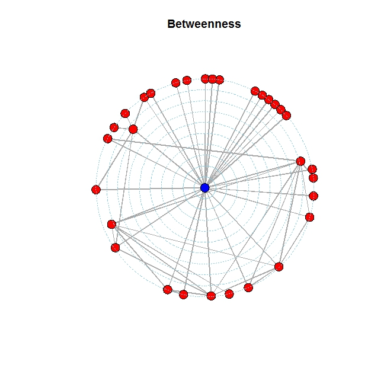

# Análisis de red: transporte aéreo colombiano
[Maykol Rodríguez Prieto]
Noviembre, 2016

## Descripción y Motivación
El transporte aéreo juega un papel fundamental en la economía del país, por esta razón el presente trabajo tiene como objetivo analizar la red de transporte aéreo colombiana, de esta forma entender sus principales características. 
Se medirán las principales propiedades propias de una red, como lo son: 

-	average shortest path

-	 degree distribution

- assortative mixing

- clustering

- betweenness centrality

- Partición de la red

Adicional a estas propiedades se hará una comparación entre la red que toma datos de las diferentes rutas entre aeropuertos colombianos en agosto del 2016 (Red "g") y la red con datos en agosto del 2006 (Red "h"). Con esto, se busca observar la evolución del transporte aéreo colombiano durante una década.

Para el presente análisis los nodos de la red son los distintos aeropuertos ubicados en las ciudades colombianas y una conexión es simplemente la existencia de un vuelo entre dos de ellos, para este caso la red se tomará no direccionada, teniendo en cuenta que en todos los casos si existe un vuelo de ida, existe vuelo de regreso.

Los datos que determinan la relación entre los distintos nodos(aeropuertos) fueron tomados de la Aeronautica Civil Colombiana, la cual en su página tiene estadísticas mensuales de origen-destino del transporte aéreo en Colombia.

## Método Utilizado
Para analizar la red de transporte aéreo colombiana se utilizo lenguaje de programación R, específicamente el paquete "iGraph". El cual permite tanto crear la red, graficar la red y características intrínsecas de ésta mismas y de igual forma obtener las principales medidas.

1. Para la creación de la red, debemos ingresar las relaciones entre los distintos nodos, para este análisis se realizo, creando vectores de relaciones, paso a seguir concatenar dicha información, y iGraph se encarga de crear la red. Para este análisis se obtuvieron dos redes. La primera, con datos de origen-destino de viajes entre aeropuertos colombianos de agosto del 2016 (Red "g") y la otra red origen-destino de agosto del 2006 (Red "h"). Ambas redes se ingresaron a R como no-direccionada.

2. Para la graficación de la red, se dieron características tanto de color y forma a vertices y nodos, esto con la finalidad de identificar diferentes relaciones dentro de la red como: nodos centrales, diametro y partición de la red.

3. iGraph es bastante detallado en sus códigos para encontrar la información que se requiere de la red y así interpretar la dinámica que esta presenta. Por esta razón medidas como Averahe Shortest Path, Degree Distribution, Clustering, entre otras una vez construida la red, son medidas faciles de obtener.

El código completo disponible [Aquí](RedTransp_Aereo_Colombia.R)

## Resultados 

- Grafica de la red "g"

La red “g” tiene 32 nodos y 50 conexiones entre los nodos.

A continuación las características y medidas de la red "g" relaciones origen-destino transporte aéreo agosoto 2016.

- Average Shortest Path de la red "g"

Esta característica se define como el promedio en la cantidad de pasos para llegar de un nodo a otro nodo.
Para el grafo g que analiza los datos de agosto de 2016, esta medida es: 2.092742.

De esta forma para la red de transporte aéreo colombiana, si se toma un origen-destino aleatorio un pasajero debería visitar dos aeropuertos para llegar a su destino final.

- Degree Distribution

Como se puede observar en la gráfica, gran cantidad de nodos en este caso aeropuertos, tienen grado 1 de conexión, ciudades como Medellín, Cali, Cartagena, San Andrés, tienen grado 4-5 y Bogotá es la única con un alto grado mayor a 20.

Dada la presencia de hubs, en este caso Bogotá (BOG) que está altamente conectado a la red analizada. La red de transporte aéreo presenta la propiedad “Scale free-Network”.

- Assortative Mixing

Una red se dice que es “Assortative” si existen conexiones entre nodos con características similares (grado) y “Disassortative” cuando existen conexiones entre nodos disimiles.

Esta medida se da a través del coeficiente de Pearson. Para la red de transporte aéreo este coeficiente es: -0.545, el cual se interpreta que la red analizada es disassortative. De lo que se concluye que aeropuertos con menos conexiones están conectados a aeropuertos con alta-media conexiones.  Esto refleja que entre pequeñas ciudades no hay vuelos existentes.

- Clustering Coefficient

Este coeficiente mide que tanto están agrupados los nodos con sus vecinos, en otras palabras, mide si los vecinos de un nodo también se conectan entre sí. Para la red de transporte aéreo este coeficiente fue de: 0.17, el cual es bajo, este se puede interpretar que aeropuertos entre ciudades cercanas no están conectados, por ejemplo: Bogotá, Rioacha están conectadas, Bogotá, Santa Marta están conectadas, pero Rioacha-Santa Marta no lo están.

- Medidas de Centralidad:

Degree: Mide el número de conexiones que tiene cada nodo.

Betweenness: Esta medida cuantifica el número de veces que un nodo hace de puente a lo largo del camino más corto entre otros dos nodos.

Betweenness centrality es una característica que involucra a vértices como lazos, para el presente análisis de red, los tres lazos que tienen mayor centralidad intermedia son:

BOG-EOH, BOG-CLO, BOG-ADZ.

- Diámetro:

Dentro todas las conexiones de nodos, el diámetro en teoría de redes se define como la mayor distancia que hay entre dos pares de estos.
Para el análisis de la red de transporte aéreo “g” se tiene que el diámetro es 4. Al identificar cuáles son los nodos que conforman esa mayor distancia se tiene que para llegar de Apartadó a Tumaco se tiene que primero ir al aeropuerto Olaya Herrera(MED), luego a Bogotá, siguiente a Cali para terminar en Tumaco. De igual forma de Tumaco-Apartadó.  

- Connectivity

Una red se dice conectada, si cada vértice es accesible desde todos los demás, es decir, si para cualesquiera dos vértices existe un lazo entre los dos.
Para la red de transporte aéreo colombiana, se tiene que es conectada. Esto quiere decir, que escoger desde un origen un destino aleatorio se puede arribar.  

- Partición de la red

La partición de una red es una herramienta útil, que busca encontrar subconjuntos de vértices que demuestren una cohesión bajo las patronas relacionales de la red.

Un subconjunto se dice cohesivo si:

•	Los nodos de este, están bien conectados entre si

•	Están relativamente bien separados de los nodos restantes de la red

A continuación se obtendrán los resultados para la red "h" correspondiente a los datos de relación viajes origen-destino del agosto del 2006 y se compararán con los hallados para la red "g".

- Grafica de la red "h"

La red “h” tiene 28 nodos y 39 conexiones entre los nodos.

- Average path length (h)

Para la red "h" esta medida es 2.124

Para la red g, fue de 2.092 es decir que en 10 años ha disminuido muy poco esta medida. Los viajeros deben visitar la misma cantidad de aeropuertos para llegar a su destino.

- Degree Distribution (h)

Con esta grafica se puede decir que en 10 años la red no ha dejado de ser scale-free, hay presencia de hubs, por lo tanto, siguen existiendo nodos altamente conectados y la mayoría con conexión baja.

- Assortative 

El coeficiente de Pearson para g es de -0.545, y para h es de -0.559 lo que significa que la red en una década no ha dejado de ser Disassortative. Por lo tanto, siguen existiendo aeropuertos con bajo grado de conexión conectados a nodos con alto grado. Pero sin conexión entre ellos.

- Clustering (h)

Para la red g, el coeficiente es de 0.17 mientras que para la red h es de 0,14. Lo que quiere decir que en 10 años no ha aumentado considerablemente, por lo tanto, sigue no existiendo conexiones aéreas entre ciudades cercanas.

- Degree Centrality

BOG Hace 10 era el único nodo central de la red y eso sigue sucediendo una decada después, por lo tanto no existe aeropuerto que en el transporte de pasajeros tenga importancia similar.

- Betweenness Centrality

En el 2006 los lazos con mayor intermediación, es decir, que sirven como puente para los demás nodos de la red son: BOG-EOH, BOG-ADZ, BOG-MZL. En el 2016 son BOG-EOH, BOG-CLO, BOG-ADZ. Es decir que en 10 años la conexión BOG-CLO se ha potencializado.

- Diametro (h)

Para la red h se tiene que el diámetro es 4, es decir se deben pasar por 4 aeropuertos para llegar al destino final. Este diámetro lo componen el viaje de APO a PVA. Se sale de Apartadó al Aeropuerto Olaya Herrera en Medellín, de ahí a Bogotá, de Bogotá a San Andrés y de San Andrés a Providencia.

El diámetro entre las dos redes cambia con respecto a los nodos que la componen. Debido a que el camino más largo en la red "g" se tiene de Apartadó a Tumaco. 

- Connectivity h

En 2006 la red de transporte aéreo estaba conectada, es decir cualquier origen-destino se puede conectar.

- Partición de la red (h)

A comparación de la red “g” la red “h” tiene solo tres subconjuntos de vértices cohesivos, esto se puede interpretar que en 10 años han aparecido nuevos aeropuertos como el caso de Tumaco y se han formado nuevas conexiones en la red.

##Conclusiones

1. Dadas las medidas encontradas y la degree distribution, la red de transporte aéreo tiene un nodo central que es Bogotá, el cual tiene un alto grado de centralidad y de intermediación y la gran mayoría de los otors nodos presentan un bajo grado de centralidad.
 Con lo anterior la red presenta una topología de estrella. La cual tiene como ventajas: 
 
- Permite agregar nuevos nodos de manera fácil.
- Reactivación rápida.
- Fácil de prevenir daños e ineficiencias
- Centralización de la red.

 Desventajas:

- Fallas en el nodo central, implica fallas en toda la red. 

2. La evolución de la red en 10 años ha sido mínima, salvo a algunos nodos y conexiones nuevas. Las características y medidas de la red no han cambiado de manera siginificativa

3. En 10 años se ha fortalecido el transporte aéreo del valle del cauca y alrededores a todo el país.

4. La red hace 10 años y ahora está totalmente conectada.

